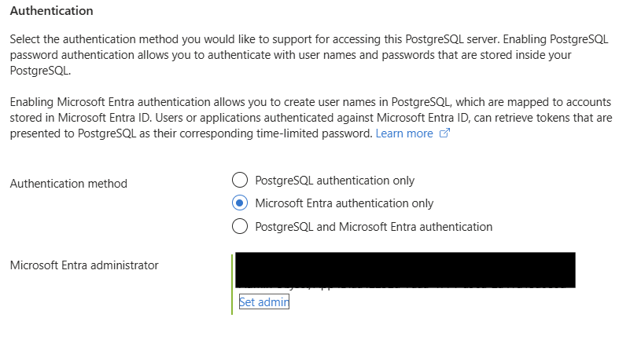
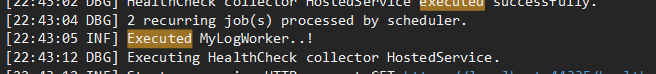

# How to Configure ABP with Hangfire, Azure PostgreSQL and Entra

In this article, you'll learn how to set up an ABP Framework application integrated with Hangfire for background job management, using Azure PostgreSQL as your database. We will utilize Entra/Azure Identities to securely connect services without needing explicit credentials.

At time of writing, this tutorial was compatible with ABP.io 9.2

# Prerequisites

Ensure you have:
- A good understanding of Azure and Azure PostgreSQL
- An Azure subscription with the rights to create an PostgreSQL server


# Setup Azure PostgreSQL Flexible Server


1. You need to create an PostgreSQL server in Azure. You can use the steps from here: https://learn.microsoft.com/en-us/azure/postgresql/flexible-server/quickstart-create-server?tabs=portal-create-flexible%2Cportal-get-connection%2Cportal-delete-resources#databases-available-in-an-azure-database-for-postgresql-flexible-server-instance. For consistency reasons, we will name the server: pgsql-hangfire. 
2. For the Authentication section
	1. select Microsoft Entra Authentication only
	2. you can set your user as the Admin 
3. Wait for azure to finish setting up the database. 

# Create and Configure the Sample Project

Create a new ABP application using the following command:

```bash
abp new Article.HangfirePgsql -t app -u mvc --mobile none --database-provider ef -uost -csf -dbms PostgreSQL -smr
```

This command creates a new project which is already configured to work with  PostgreSQL 

# Configure ABP Application

## Update Connection String

Open both appsettings.json files from projects  Article.HangfirePgsql.Web and Article.HangfirePgsql.DbMigrator.
 
Update your connection details with

```json
"ConnectionStrings": {
    "Default": "Host=pgsql-hangfire.postgres.database.azure.com;Port=5432;Database=postgres;User ID=#replace with your email"
}
```

## Integrate Azure Identity

Install the following nuget package into Article.HangfirePgsql.EntityFrameworkCore:

```bash
dotnet add package Azure.Identity
```

In project Article.HangfirePgsql.EntityFrameworkCore, create the following static class:
```c#
using Azure.Core;
using Azure.Identity;
using Npgsql;
using System;

namespace Article.HangfirePgsql.EntityFrameworkCore;

public static class AzureNpgsqlDataSource
{
    //Kudos https://mattparker.dev/blog/azure-managed-identity-postgres-aspnetcore

    public static NpgsqlDataSource CreateAzureManagedIdentityEnabledSource(string connectionString)
    {
        var dataSourceBuilder = new NpgsqlDataSourceBuilder(connectionString);

        if (dataSourceBuilder.ConnectionStringBuilder.Password is null) // lets us supply a password locally, bypassing this expiry handling
        {
            ConfigurePeriodicPasswordProvider(dataSourceBuilder);
        }
        return dataSourceBuilder.Build()!;
    }

    public static void ConfigurePeriodicPasswordProvider(NpgsqlDataSourceBuilder dataSourceBuilder)
    {

        dataSourceBuilder.UsePeriodicPasswordProvider(
            async (connectionStringBuilder, cancellationToken) =>
            {
                try
                {
                    var options = new DefaultAzureCredentialOptions();
                    var credentials = new DefaultAzureCredential(options);
                    var token = await credentials.GetTokenAsync(new TokenRequestContext(["https://ossrdbms-aad.database.windows.net/.default"]), cancellationToken);
                    return token.Token;
                }
                catch
                {
                    throw;
                }
            },
            TimeSpan.FromHours(4), // successRefreshInterval
            TimeSpan.FromSeconds(10) // failureRefreshInterval
        );
    }
}
```

This class is used to dynamically provide a password for the connection to the database. In case of entra enabled resources, the access token for the identity will be used as the password.

After this. go to class HangfirePgsqlEntityFrameworkCoreModule and replace  options.UseNpgsql(); with:

```c#
            options.UseNpgsql(o =>
            {
                o.ConfigureDataSource(ds => AzureNpgsqlDataSource.ConfigurePeriodicPasswordProvider(ds));
            });
```

## Test Database connection

Run the dbmigrator project. 
If everything was configured correctly, then you will see a success message and the database should be migrated to latest. 
 

**Note: depending on the database tier, the first couple of requests to the database could fail. A an example b1ms exhibits this behavior.  Just try again**

# Integrate Hangfire

We are going to use the existing hangfire integration with ABP. For simplicity sake, we are just going to implement a basic worker so that we can test the use case.  
1. Follow the steps from here https://abp.io/docs/latest/framework/infrastructure/background-workers/hangfire. For reference, install the module into project Article.HangfirePgsql.Application
2. Install the Hangfire PostgreSQL package into project Article.HangfirePgsql.Web
```
dotnet add package Hangfire.PostgreSql
```
3. Create a new class called  AzureManagedIdentityNpgsqlConnectionFactory in project Article.HangfirePgsql.Web with the following content
``` c#
    public class AzureManagedIdentityNpgsqlConnectionFactory(string connectionString, PostgreSqlStorageOptions options, [CanBeNull] Action<NpgsqlConnection>? connectionSetup = null) : NpgsqlInstanceConnectionFactoryBase(options)
    {
        private readonly NpgsqlDataSource _dataSource = AzureNpgsqlDataSource.CreateAzureManagedIdentityEnabledSource(connectionString);

        [CanBeNull] private readonly Action<NpgsqlConnection>? _connectionSetup = connectionSetup;

        public override NpgsqlConnection GetOrCreateConnection()
        {
            var connection = _dataSource.CreateConnection();

            _connectionSetup?.Invoke(connection);

            return connection;
        }
    }
```
This class is used to generate a connection for the Hangfire provider, by using the Identity password generator. 

4. Create a new method called ConfigureHangfire in HangfirePgsqlWebModule with the following content:
```c# 

    private static void ConfigureHangfire(ServiceConfigurationContext context, IConfiguration configuration)
    {
        context.Services.AddHangfire(config =>
        {

            var options = new PostgreSqlStorageOptions
            {
                PrepareSchemaIfNecessary = true, //migrate database everytime
                                DistributedLockTimeout = TimeSpan.FromMinutes(5)

            };

            config.UsePostgreSqlStorage(c => c.UseConnectionFactory(new AzureManagedIdentityNpgsqlConnectionFactory(configuration.GetConnectionString("Default")!, options)), options);
        });

    }
```
5. Call method ConfigureHangfire from ConfigureServices

As a final step, we are going to implement a test worker. Create the following class in project Article.HangfirePgsql.Application
``` c#
    public class MyLogWorker : HangfireBackgroundWorkerBase
    {
        public MyLogWorker()
        {
            RecurringJobId = nameof(MyLogWorker);
            CronExpression = "* * * * *"; //every minute
        }

        public override Task DoWorkAsync(CancellationToken cancellationToken = default)
        {
            Logger.LogInformation("Executed MyLogWorker..!");
            return Task.CompletedTask;
        }
    }
```

Register the worker in HangfirePgsqlApplicationModule
``` c#
    public override async Task OnApplicationInitializationAsync(
    ApplicationInitializationContext context)
    {
        await context.AddBackgroundWorkerAsync<MyLogWorker>();
    }
```
6. Run project Article.HangfirePgsql.Web. Search in your output logs for "Executed MyLogWorker..!". If this sentence is present, it means that your integration is working like a charm



**Note: depending on the database tier, the first couple of requests to the database could fail. A an example b1ms exhibits this behavior.  Just try again**

# Summary


You've successfully set up an ABP application integrated with Hangfire and PostgreSQL, securely configured using Entra. 

From here you can easily extend this to work with other Azure Identities like App Services. As a pointer, you can use an entra group instead of a user. In the connection string, use the name of the group instead of your email 

```
"ConnectionStrings": {
    "Default": "Host=pgsql-hangfire.postgres.database.azure.com;Port=5432;Database=postgres;User ID=#replace with name of entra group"
}
```


Also, I have submitted a [PR](https://github.com/hangfire-postgres/Hangfire.PostgreSql/pull/399) to the Hangfire.PostgreSql team, which will mostly make this tutorial obsolete, since the code there will take the heavy lifting when using Azure Identities. Right now, the PR is not merged because the team is working on a major overhaul of the package and that will take some time

# Acknowledgements 

Part of this tutorial works, because of content from this website: https://mattparker.dev/blog/azure-managed-identity-postgres-aspnetcore